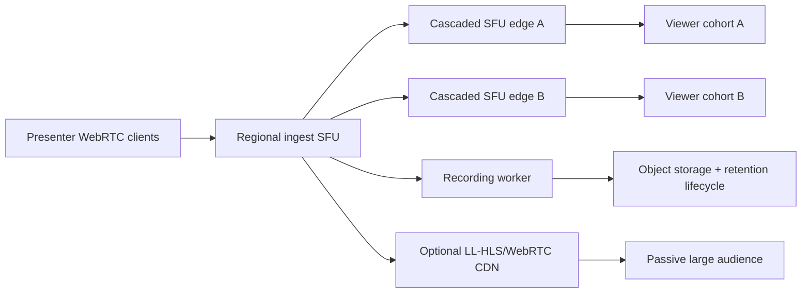

# Media Backend Readiness

This backend now has authenticated SFU signaling and recording lifecycle hooks, but a true 10k-viewer webinar deployment still requires cascaded media edges or a CDN-style fanout tier outside this single app process.

## Current State

- The SFU package uses Pion WebRTC and registers AV1, VP9, VP8 for video plus Opus for browser-safe audio. Experimental Lyra can be registered with `WEBRTC_ENABLE_EXPERIMENTAL_LYRA=true` for native clients or gateways, but it is not a browser-WebRTC default.
- The SFU enables NACK, RTCP reports, TWCC, and simulcast header extensions for packet recovery and congestion/quality feedback.
- Calls create logical SFU rooms, and webinar joiners are now modeled as viewers instead of interactive participants.
- WebSocket signaling now routes through call participant authorization before forwarding to the target user.
- The call API exposes signed, short-lived media join tokens, offer/answer exchange, trickle ICE candidate ingestion, and ICE restart answers.
- Media tokens are scoped to workspace, call, user, role, and expiry. Viewer tokens are added to SFU rooms as receive-only viewers, while presenters are added as presenter peers.
- Media admission is policy-driven through `WEBRTC_MAX_ROOMS_PER_NODE`, `WEBRTC_MAX_PRESENTERS_PER_CALL`, `WEBRTC_MAX_VIEWERS_PER_CALL`, `WEBRTC_MAX_SCREEN_SHARES_PER_CALL`, `WEBRTC_MAX_TRACKS_PER_PRESENTER`, and `WEBRTC_MEDIA_TOKEN_TTL`.
- Webinar/selector participants can now be promoted or demoted by host/co-host role workflows, which lets a host elevate viewers to presenters without making all 10k attendees bidirectional publishers.
- Recording start now respects the call recording setting and assigns retention expiry when configured.
- Recording lifecycle workers can process stopped recordings into ready artifacts, delete expired recording objects plus metadata, and emit `recording.ready` hooks for downstream AI transcription/analysis jobs. The actual media recorder/muxer is pluggable through `recording.Processor`.

## Gaps Before Production SFU Use

- The SFU signaling path is API-wired, but still needs end-to-end browser integration tests with real SDP/ICE flows and TURN-only network cases.
- Admission control now covers room counts, presenter counts, viewer counts, screen-share streams, and per-presenter track counts. It still needs bitrate budgets, regional capacity routing, and per-workspace/plan quotas.
- There is no cascading SFU, regional routing, selective subscription policy, or media-edge discovery for very large webinars.
- There is no observability loop for RTP loss, jitter, RTT, bitrate, CPU, memory, egress, or per-track quality decisions.
- Screen sharing and viewer publishing are guarded at the API and SFU room role layer, but the client should also negotiate viewer PeerConnections as recvonly to reduce attack surface and wasted negotiation.
- Recording workers need a concrete SFU recorder implementation that subscribes to presenter tracks, muxes WebM/MP4, writes object storage artifacts, and emits transcription/AI jobs.

## 10k+ Webinar Target Architecture

- Use presenter ingest PeerConnections into an SFU edge, then fan out through cascaded SFU nodes or a WebRTC CDN/LL-HLS path for passive viewers.
- Keep the number of active presenters small and explicit; treat 10k users as viewers, not bidirectional participants.
- Use simulcast/SVC with server-side subscription selection, per-viewer downshift, and aggressive egress budgeting.
- Use signed room join tokens scoped to workspace, call, user, role, and expiry before allowing SDP exchange.
- Run TURN capacity separately from app servers and monitor relay percentage, egress, and failure rates.
- Use per-call and per-tenant limits for rooms, presenters, viewers, bitrate, screen-share streams, and recording jobs.
- Move recording/transcription to worker pipelines that subscribe to SFU media or finalized artifacts rather than blocking the signaling/API process.

Recommended production shape:

Operational requirements before claiming 10k+ readiness:

- Regional media-edge discovery and sticky call assignment.
- Cascaded SFU replication or managed WebRTC CDN/LL-HLS distribution for passive viewers.
- Per-node and per-tenant admission control for presenters, viewers, tracks, bitrate, and recording jobs.
- TURN fleet sizing, relay-rate alerts, and UDP firewall/port-range automation.
- Metrics and alerts for packet loss, RTT, jitter, bitrate, reconnects, ICE failures, CPU, memory, and egress.
- End-to-end media tests with presenter, viewer, screen share, ICE restart, TURN-only, recording, and node-failure scenarios.
